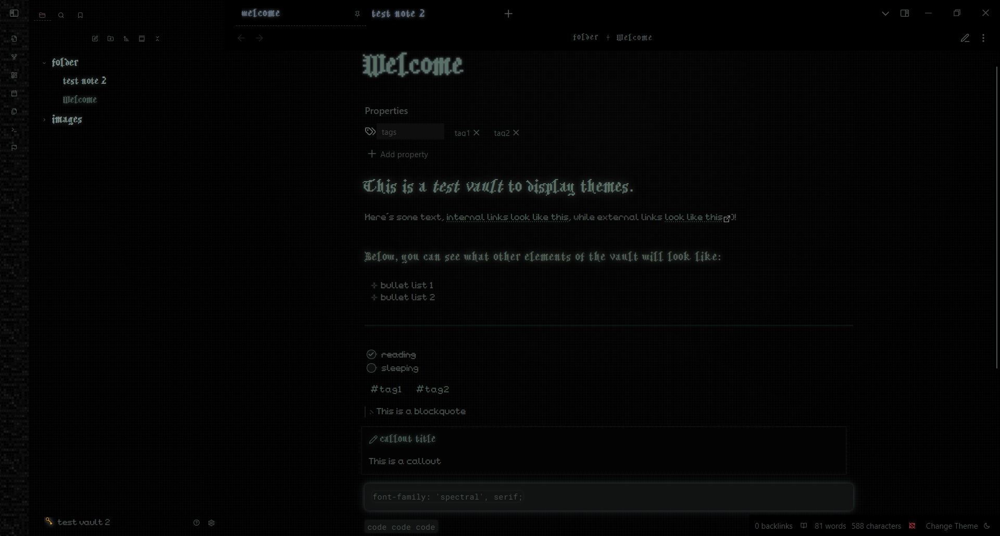
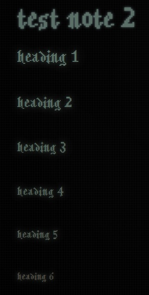

# cranky goblin

Deep in the dungeon tunnels, a goblin with more patience for tools than for people kept a small notebook. Its pages were smudged with charcoal, its margins full of muttered improvements and half‑finished ideas. This theme is one of those ideas: simple, sturdy, and made to stay out of the way.

**cranky goblin** offers a muted, low‑contrast interface shaped for long hours of quiet work. Glows are faint, like the shimmer of fungus‑light on stone. Icons and markers lean toward small, practical shapes - nothing ornate, nothing flashy. The palette is cold and calm, meant to rest the eyes rather than impress them.

### Features

- A restrained, moss‑grey colour scheme inspired by underground tunnels and dim lanterns.

- Subtle glows around code and structure, more like lingering magic than decoration.

- Pixel-leaning accents that feel handmade rather than polished.

- Fonts: Lower Pixel for text, PixelWarden for headings and other elements.

### Intent

This is not a heroic interface or a grand spellbook.
It is a goblin’s tool: plain, reliable, and quietly enchanted, built to help you get things done without fuss.

### Additional notes

> Inspired by the PixelWarden font, retro roguelike RPGs, and the dungeoncore aesthetic.

> This theme was originally just supposed to be a slight edit of my deep submerge theme, but it became its own thing very quickly. It keeps the same sleek appearance and a similarly muted color palette.

### Screenshots

Dark mode only:

Glowing headings with a slight gradient.

